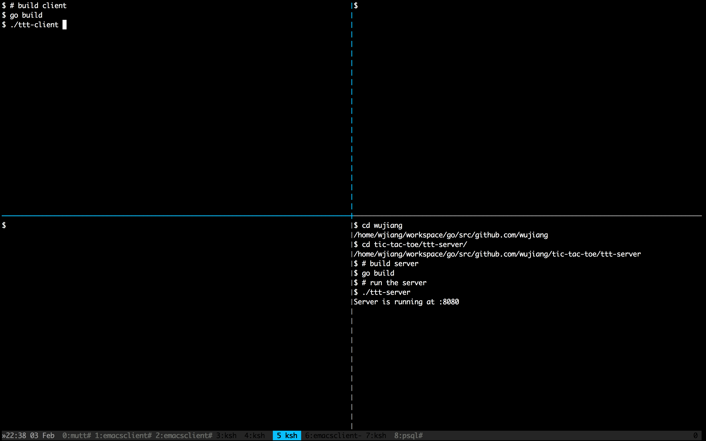

# Tic-tac-toe in Terminal

[Tic-tac-toe](http://en.wikipedia.org/wiki/Tic-tac-toe) is a 2-player
zero-sum game on a 3 x 3 grid. This program provides an
experience of playing the game within a terminal.

## Usage

- Run server: `ttt-server`
- Run client: `ttt-client`

## Install

0. [Go setup](http://golang.org/doc/install)
1. Please use [godep](https://github.com/tools/godep) `godep restore`
   to install all dependencies.
2. Run `go install` in `ttt-client` and `ttt-server`
